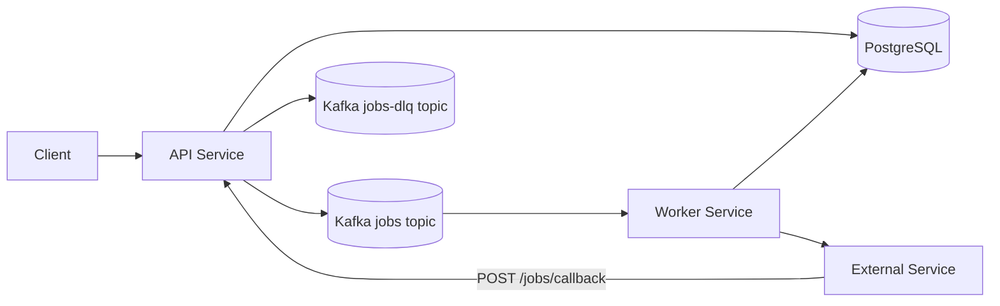

# Distributed Job Orchestration Platform

A distributed job orchestration platform that models real-world asynchronous processing in SaaS and fintech systems: REST APIs, PostgreSQL for durable state, Apache Kafka for work distribution, and a separate worker process that executes jobs and updates lifecycle (including external webhooks and callbacks).

## Features

- **Job lifecycle** — `PENDING`, `QUEUED`, `RUNNING`, `COMPLETED`, `FAILED`.
- **Job types** — `EMAIL` and `REPORT` (handled inside the worker), `EXTERNAL` (outbound HTTP to a partner URL, then completion via `POST /jobs/callback`).
- **API service** — Create jobs, read status, retry failed jobs, accept external callbacks.
- **Worker service** — Kafka consumer; claims `QUEUED` jobs, runs handlers, writes status back to the **same** Postgres database as the API.
- **Kafka** — Work is published to the `jobs` topic; terminal timeout failures publish minimal messages to `jobs-dlq` for audit.
- **PostgreSQL** — Single source of truth for job rows; schema owned by **Flyway** in `api-service` (worker validates only).
- **Docker Compose** — Local Postgres (host **5433**), ZooKeeper, and Kafka.

## Architecture



The API persists jobs and enqueues work **only after** the row is `QUEUED`, so the worker never processes a Kafka message for a job that is still `PENDING` in the database.

## Design Decisions & Tradeoffs

### Database vs Kafka ordering

Jobs are persisted and moved to `QUEUED` before publishing to Kafka.

**Why:**
- Prevents workers from consuming jobs that do not yet exist in the database
- Avoids phantom execution scenarios

**Tradeoff:**
- Does not guarantee atomicity between DB and Kafka
- In production systems, this is often solved using the Outbox Pattern

### Shared database between services

Both API and worker services use the same PostgreSQL database.

**Why:**
- Simplifies coordination and reduces infrastructure complexity
- Suitable for learning and demonstration

**Tradeoff:**
- Tighter coupling between services
- Production systems often use separate databases per service

### External job completion via callback

EXTERNAL jobs remain in `RUNNING` until a callback is received.

**Why:**
- Models real-world async workflows (for example third-party processing)
- Avoids blocking the worker thread

**Tradeoff:**
- Requires timeout handling for reliability
- Requires secure callback validation

## Failure Scenarios

### Worker crashes during execution

- Job can remain in `RUNNING`
- Watchdog detects stale jobs using `running_started_at`
- Job is re-queued (if retries remain) or marked `FAILED`

### External service never responds

- Job remains in `RUNNING`
- Watchdog triggers retry after timeout
- After retry limit is exceeded, job is marked `FAILED` and published to DLQ

### Kafka message delivered multiple times

- Worker checks current job status before execution
- Only `QUEUED` jobs are processed, which limits duplicate processing

### Callback forgery attempt

- Optional `X-Callback-Secret` is validated
- Invalid requests are rejected

## Consistency Model

The system follows an **at-least-once processing model**:

- Kafka may deliver messages more than once
- Workers reduce duplicate effects by checking persisted job state before execution
- External integrations may be retried, so partner endpoints should be idempotent

## Tech stack

| Area         | Choice |
|-------------|--------|
| Language    | Java 17+ |
| Framework   | Spring Boot 3.x |
| Persistence | Spring Data JPA, PostgreSQL |
| Messaging   | Spring Kafka, Apache Kafka |
| Migrations  | Flyway (in `api-service`) |
| Build       | Maven (multi-module) |
| Containers  | Docker, Docker Compose |

## Repository layout

```text
├── common-lib/          # Shared enums, Kafka topic names, JobMessage DTO
├── api-service/         # REST API, Kafka producer, Flyway migrations
├── worker-service/      # Kafka consumer + job execution (same DB as API)
├── scripts/             # Manual E2E: e2e-smoke.sh
├── docker-compose.yml   # Postgres (5433), ZooKeeper, Kafka
├── pom.xml              # Parent POM
└── .env.example         # Copy to .env for local secrets / DB credentials
```

## Prerequisites

- JDK 17+
- Maven 3.9+
- Docker Desktop (or Docker Engine + Compose) for local infrastructure

## Quick start

### 1. Configuration

```bash
cp .env.example .env
```

Edit `.env` for your machine. Keep it out of version control.

### 2. Start infrastructure

```bash
docker compose up -d postgres zookeeper kafka
docker compose ps
```

Postgres listens on **host port 5433** (inside the container it is still `5432`).

### 3. Build and test

From the repository root:

```bash
mvn clean verify
```

This compiles all modules and runs **unit tests** (including the worker’s `JobExecutionService` tests).

### 4. Run the API

IDE: `com.distributedjob.api.ApiServiceApplication`, or:

```bash
mvn -pl api-service spring-boot:run
```

Use the same `POSTGRES_*` (and optional `CALLBACK_SECRET`) as in Compose / `.env` — e.g. `source .env` before `mvn` if you rely on env vars.

Default port: **8080**. Settings: `api-service/src/main/resources/application.yml`.

### 5. Run the worker

IDE: `com.distributedjob.worker.WorkerServiceApplication`, or:

```bash
mvn -pl worker-service spring-boot:run
```

Use the **same** database credentials and Kafka bootstrap as the API (`localhost:9092` with the provided Compose file). Default port: **8081**. Settings: `worker-service/src/main/resources/application.yml` (Flyway is **disabled** in the worker; migrations run from the API).

### 6. Try a single job (Postman or curl)

```http
POST /jobs
Content-Type: application/json

{
  "type": "EMAIL",
  "payloadJson": "{\"to\":\"user@example.com\"}"
}
```

Then `GET /jobs/{id}` with the returned `id`. With both services up, an `EMAIL` job should reach `COMPLETED` after the worker consumes the message.

### 7. Manual E2E script (all job types)

With Compose + **api-service** + **worker-service** running:

```bash
bash scripts/e2e-smoke.sh
```

| Variable        | Purpose |
|----------------|---------|
| `API_URL`       | API base URL (default `http://127.0.0.1:8080`) |
| `MAX_WAIT_SEC`  | Poll timeout per step (default `60`) |
| `WEBHOOK_URL`   | URL the worker POSTs to for `EXTERNAL` jobs (default `https://httpbin.org/post`; worker needs outbound HTTPS) |
| `CALLBACK_SECRET` | If set on the API (`job.callback.secret`), export the same value so `/jobs/callback` succeeds |
| `WATCHDOG_TEST` | Optional timeout scenario (`1` to enable). Requires API `job.external.running-timeout` small enough for smoke runtime |
| `WATCHDOG_WAIT_SEC` | Max wait for watchdog retry increment in optional scenario (default `90`) |
| `DLQ_TEST` | Optional DLQ scenario (`1` to enable). Requires API with short timeout and low retry budget to force terminal timeout quickly |
| `DLQ_WAIT_SEC` | Max wait for the DLQ scenario job to reach `FAILED` (default `90`) |
| `KAFKA_CONTAINER` | Kafka container name for optional DLQ check (default `djop-kafka`) |

The script runs **EMAIL**, **REPORT**, **EXTERNAL** (callback `COMPLETED`), and **EXTERNAL** (callback `FAILED`).

## HTTP API (overview)

| Method | Path | Purpose |
|--------|------|---------|
| `POST` | `/jobs` | Create job: persist `PENDING` → `QUEUED`, **then** publish to Kafka |
| `GET` | `/jobs` | List jobs (optional `status`, `type`; Spring Data `page`, `size`, `sort`; `size` capped at 100) |
| `GET` | `/jobs/{id}` | Read job by UUID |
| `POST` | `/jobs/{id}/retry` | Re-queue a **failed** job when `retries < job.retry.max` (increments retries, publishes after `QUEUED` is saved; returns `409` when retry budget is exhausted) |
| `POST` | `/jobs/callback` | Partner completion for **EXTERNAL** jobs in **RUNNING** (`COMPLETED` or `FAILED`) |

If `job.callback.secret` is set, send header `X-Callback-Secret` on `/jobs/callback`.

## Configuration

| Location | Notes |
|----------|--------|
| `api-service/src/main/resources/application.yml` | Datasource, Kafka producer, `job.callback.secret`, `job.retry.max`, `job.external.running-timeout`, `job.watchdog.fixed-delay` (see `JobProperties`) |
| `worker-service/src/main/resources/application.yml` | Datasource, Kafka consumer, webhook timeouts |

`jobs.running_started_at` is set when a worker claims a job (`RUNNING`) and cleared when the job leaves `RUNNING`; it supports EXTERNAL timeout scans and listing indexes on `(status, type)`.

Environment variables commonly mirror Docker Compose (`POSTGRES_DB`, `POSTGRES_USER`, `POSTGRES_PASSWORD`, `CALLBACK_SECRET`).

Kafka bootstrap defaults to `localhost:9092` for local Compose.

## Database migrations

Flyway SQL lives under `api-service/src/main/resources/db/migration/`. Hibernate uses **validate**; DDL is not auto-generated in production paths.

`jobs-dlq` receives minimal dead-letter messages when EXTERNAL timeout handling reaches terminal failure due to retry budget exhaustion; `api-service` includes a log consumer (`JobDlqListener`) for audit visibility.

## Logging

`com.distributedjob` is set to **DEBUG** in the bundled `application.yml` files for easier local tracing; tighten per package as needed.

## Roadmap

- **Worker hardening** — richer failure detail in DB and stronger idempotency guarantees for repeated EXTERNAL webhook attempts
- **Optional** — Metrics, Redis, dashboard UI

## License

See [LICENSE](LICENSE) in this repository.
